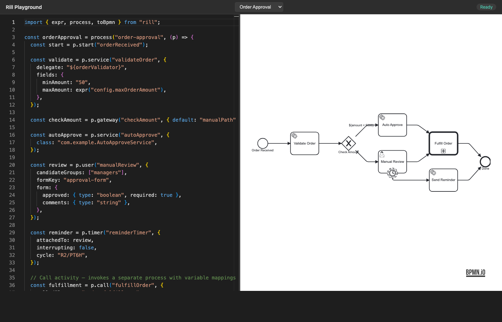
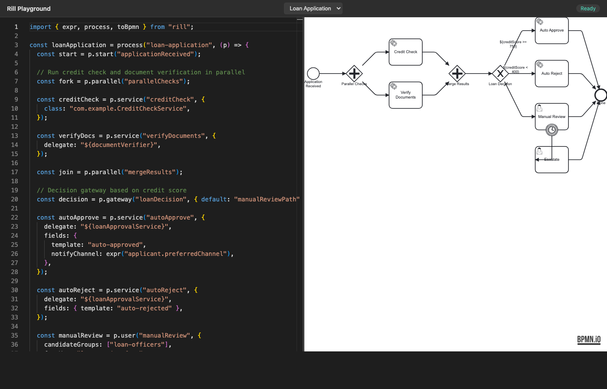
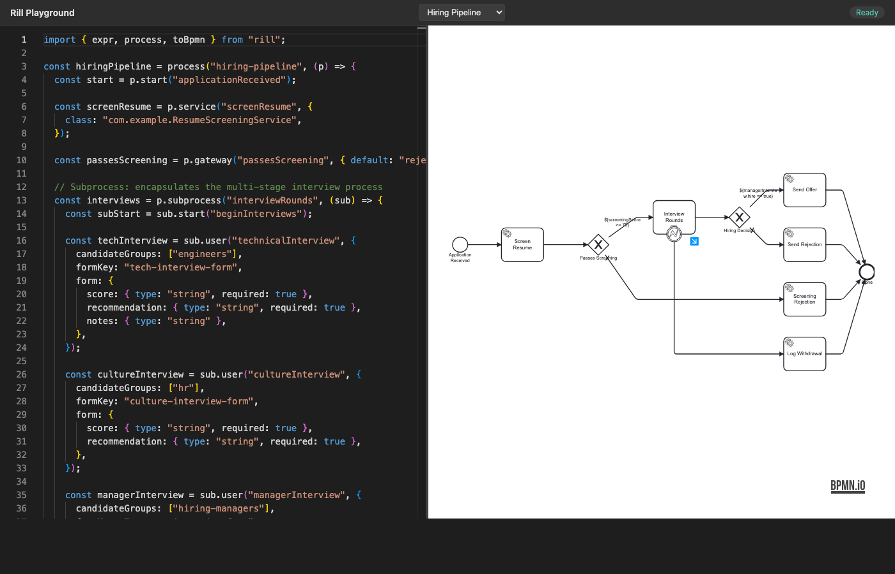

# rill

TypeScript DSL that compiles to Flowable 6.8 BPMN 2.0 XML.

Define BPMN processes as TypeScript code, get validated XML out. No drag-and-drop editors, no XML by hand.

### Order Approval


### Loan Application


### Hiring Pipeline


## Why Rill?

- **Code over clicks** — no sidebars, no scrolling through property panels, no drag-and-drop. Define everything explicitly in TypeScript.
- **Type safety** — catch errors at compile time, not at Flowable runtime. Variable references, element IDs, and flow wiring are all checked by TypeScript before any XML is generated.
- **Explicit data flow** — declare what variables each task reads and produces (`in`/`out`). No hidden reliance on global process scope.
- **Less error-prone** — no dangling edges, no flows connected to the wrong element, no accidentally deleted connections. If `flow(a, b)` compiles, `a` and `b` exist. The validator catches the rest.
- **Auto-layout** — no manual positioning. The playground renders a clean diagram from the XML automatically. Move a task in code, the layout updates. No nudging boxes around a canvas.
- **Reviewable** — TypeScript diffs are readable. BPMN XML diffs are not. Code review works naturally.
- **Testable** — process definitions are plain data. Unit test your process logic without deploying to Flowable.
- **Composable** — processes are TypeScript functions. Extract patterns, share utilities, build libraries of reusable process fragments.
- **Version control friendly** — TypeScript is text. Branching, merging, blame, and history all work as expected.

## Install

```bash
npm install rill
```

Requires Node.js 18+.

## Quick start

```typescript
import { process, toBpmn } from "rill";

const vacationRequest = process("vacation-request", (p) => {
  const start = p.start("requestSubmitted");

  const approve = p.user("managerApproval", {
    candidateGroups: ["management"],
    formKey: "vacation-approval-form",
    out: { approved: Boolean, reason: String },
    form: {
      approved: { type: "boolean", required: true },
      reason: { type: "string" },
    },
  });

  const { approved } = approve;

  const decision = p.gateway("approvalDecision");

  const notify = p.service("notifyEmployee", {
    delegate: "${notificationService}",
    fields: { template: "vacation-approved" },
  });

  const reject = p.service("notifyRejection", {
    delegate: "${notificationService}",
    fields: { template: "vacation-rejected" },
  });

  const updateCalendar = p.service("updateCalendar", {
    class: "com.example.CalendarService",
  });

  const end = p.end("done");

  p.pipe(start, approve, decision);
  p.flow(decision, notify, approved);
  p.flow(decision, reject, "${!approved}");
  p.pipe(notify, updateCalendar, end);
  p.flow(reject, end);
});

console.log(toBpmn(vacationRequest));
```

## API

All process building happens inside the callback passed to `process()`. The callback receives a `ProcessBuilder` instance (`p` by convention).

### Defining elements

Every builder method takes an `id` string and an options object, and returns an `ElementRef` you use when wiring flows.

#### `p.start(id, options?)`

Start event. Optional `name`.

```typescript
const start = p.start("orderReceived");
```

#### `p.end(id)`

End event.

```typescript
const end = p.end("done");
```

#### `p.service(id, options)`

Service task. Specify either `delegate` (a delegate expression) or `class` (a fully-qualified Java class name). Optional `fields`, `name`, and `async`.

```typescript
const validate = p.service("validateOrder", {
  delegate: "${orderValidator}",
  fields: {
    minAmount: "50",
    maxAmount: expr("config.maxOrderAmount"),
  },
});
```

Use `expr()` to mark a field value as a Flowable expression rather than a plain string.

#### `p.script(id, options)`

Script task. `script` is the script body, `format` defaults to `"groovy"`.

```typescript
const calc = p.script("calcDiscount", {
  script: 'execution.setVariable("discount", amount * 0.05)',
  format: "groovy",
  autoStoreVariables: true,
});
```

#### `p.user(id, options)`

User task. Supports `assignee`, `candidateGroups`, `formKey`, and inline `form` properties.

```typescript
const review = p.user("manualReview", {
  candidateGroups: ["managers"],
  formKey: "approval-form",
  form: {
    approved: { type: "boolean", required: true },
    comments: { type: "string" },
  },
});
```

#### `p.gateway(id, options?)`

Exclusive gateway. Use `default` to specify the ID of the default outgoing flow.

```typescript
const check = p.gateway("checkAmount", { default: "manualPath" });
```

#### `p.parallel(id, options?)`

Parallel gateway for fork/join patterns.

```typescript
const fork = p.parallel("forkWork");
```

#### `p.timer(id, options)`

Timer boundary event attached to another element. Supports `duration`, `date`, or `cycle`. Set `interrupting: false` for non-interrupting timers.

```typescript
const reminder = p.timer("reminderTimer", {
  attachedTo: review,
  interrupting: false,
  cycle: "R2/PT6H",
});
```

#### `p.timerCatch(id, options)`

Intermediate timer catch event (standalone, not attached to another element).

```typescript
const wait = p.timerCatch("waitOneHour", { duration: "PT1H" });
```

#### `p.errorBoundary(id, options)`

Error boundary event attached to another element.

```typescript
p.error("paymentError", "PAYMENT_FAILED");
const onError = p.errorBoundary("catchPaymentError", {
  attachedTo: paymentTask,
  errorRef: "paymentError",
});
```

#### `p.subprocess(id, builderFn, options?)`

Embedded sub-process. The builder function receives its own `ProcessBuilder` scoped to the sub-process.

```typescript
const sub = p.subprocess("retryBlock", (s) => {
  const subStart = s.start("subStart");
  const attempt = s.service("attempt", { delegate: "${retryService}" });
  const subEnd = s.end("subEnd");
  s.pipe(subStart, attempt, subEnd);
});
```

#### `p.error(id, errorCode)`

Declares an error definition at the process level (used with `errorBoundary`).

### Typed variables

Declare what variables your process expects and what each task reads and produces.

#### `p.var(name, varType)`

Declares a process-level input variable. Returns a `Var` handle. Uses TypeScript constructors as type markers.

```typescript
const orderId = p.var("orderId", String);
const amount = p.var("amount", Number);
const active = p.var("active", Boolean);
const created = p.var("created", Date);
```

#### `in` / `out` on tasks

Service, user, and script tasks accept `in` (variables the task reads) and `out` (variables the task produces). When `out` is provided, the returned ref carries the output vars as properties you can destructure:

```typescript
const validate = p.service("validateOrder", {
  delegate: "${orderValidator}",
  in: [orderId, amount],
  out: { isValid: Boolean, errors: String },
});

const { isValid, errors } = validate;
```

#### `Var` as flow condition

Pass a `Var` directly to `flow()` as the condition — it converts to `${varName}`:

```typescript
p.flow(gateway, autoApprove, isValid);  // → condition="${isValid}"
```

### Wiring flows

#### `p.pipe(...refs)`

Connects elements in a linear chain. Given `pipe(a, b, c)`, it creates flows `a -> b` and `b -> c`.

```typescript
p.pipe(start, validate, checkAmount);
p.pipe(autoApprove, end);
```

Use `pipe()` when elements connect in a straight line with no conditions.

#### `p.flow(source, target, condition?)`

Creates a single sequence flow between two elements. The third argument is either a condition expression string or a `FlowOptions` object with `id` and/or `condition`.

```typescript
// Unconditional flow
p.flow(start, validate);

// Conditional flow with UEL expression
p.flow(check, autoApprove, "${amount < 5000}");

// Flow with explicit ID (useful for gateway defaults)
p.flow(check, review, { id: "manualPath" });

// Flow with both ID and condition
p.flow(check, review, { id: "manualPath", condition: "${amount >= 5000}" });
```

Use `flow()` when you need conditional branching or must set a specific flow ID (e.g., for gateway `default` references).

### `pipe()` vs `flow()`

| | `pipe()` | `flow()` |
|---|---|---|
| Purpose | Linear chains | Individual connections |
| Conditions | No | Yes |
| Custom flow IDs | No | Yes |
| Multiple targets | Chain: `a -> b -> c` | Single: `a -> b` |

A common pattern is to use `pipe()` for the straight-line parts and `flow()` for the conditional splits:

```typescript
p.pipe(start, validate, checkAmount);       // linear chain
p.flow(checkAmount, autoApprove, "${...}"); // conditional branch
p.flow(checkAmount, review, { id: "manualPath" }); // default branch
p.pipe(autoApprove, end);                   // linear continuation
p.pipe(review, end);                        // linear continuation
```

### Generating XML

```typescript
import { toBpmn } from "rill";

const xml = toBpmn(definition);
```

`toBpmn()` takes a `ProcessDefinition` (the return value of `process()`) and returns a complete BPMN 2.0 XML string with Flowable namespace extensions.

### Validation

The `process()` function validates the definition before returning:

- At least one start event and one end event must exist.
- All flows must reference existing elements.
- Gateway default flows must exist among outgoing flows.
- Boundary events must reference existing elements.

If validation fails, `process()` throws with a list of error messages.

## CLI

The package includes a CLI for compiling and deploying process definitions.

### Compile

```bash
# Write XML to file (creates <process-id>.bpmn20.xml)
rill compile process.ts

# Write to stdout
rill compile process.ts --stdout

# Write to a specific directory
rill compile process.ts --out-dir dist/
```

The input file must export at least one `ProcessDefinition` (the return value of `process()`). Multiple exports produce multiple XML files.

### Deploy

Compile and deploy directly to a running Flowable instance:

```bash
rill deploy process.ts --url http://localhost:8080/flowable-rest

# With authentication
rill deploy process.ts \
  --url http://localhost:8080/flowable-rest \
  --username admin \
  --password test

# With tenant ID
rill deploy process.ts \
  --url http://localhost:8080/flowable-rest \
  --tenant-id my-tenant
```

## Programmatic deploy

```typescript
import { process, toBpmn, deploy } from "rill";

const definition = process("my-process", (p) => { /* ... */ });
const xml = toBpmn(definition);

const result = await deploy(definition, xml, {
  url: "http://localhost:8080/flowable-rest",
  auth: { username: "admin", password: "test" },
  tenantId: "my-tenant", // optional
});

console.log(`Deployed: ${result.id}`);
```

## Documentation

- [Playground](docs/playground.md) - Browser-based editor with live BPMN diagram preview

## Development

```bash
npm install
npm run build        # Build with tsup
npm run typecheck    # Type-check without emitting
npm test             # Run tests with vitest
npm run lint         # Lint with Biome
npm run playground   # Start the playground dev server
```

## License

MIT
